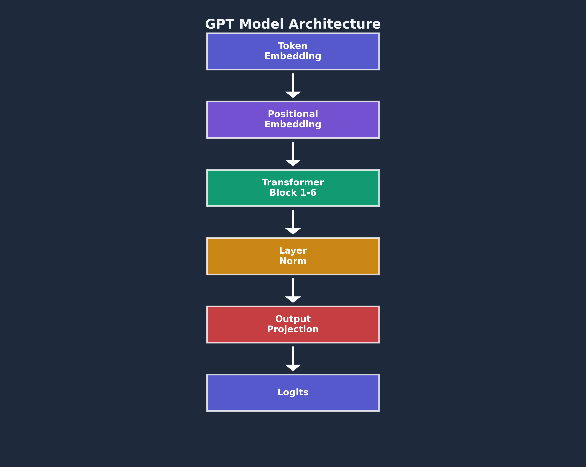
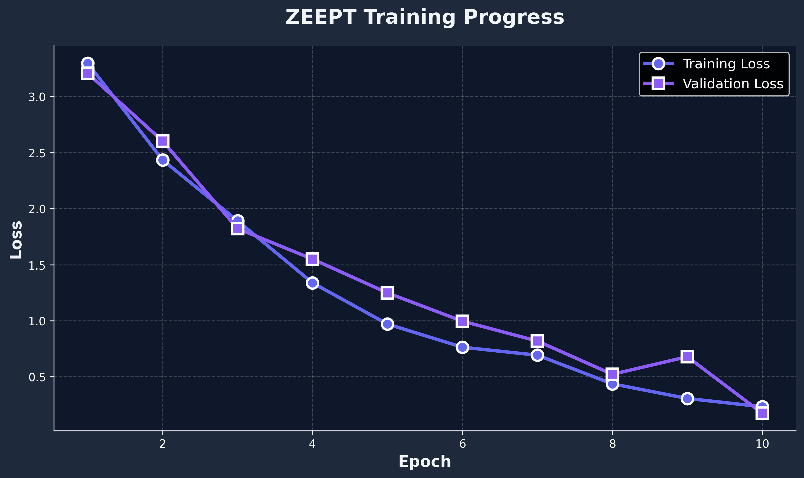
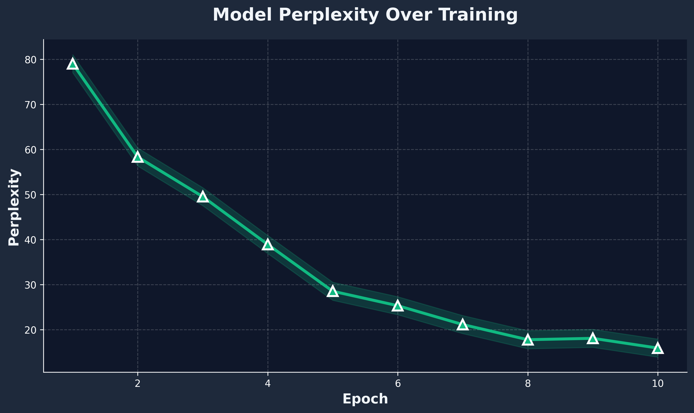
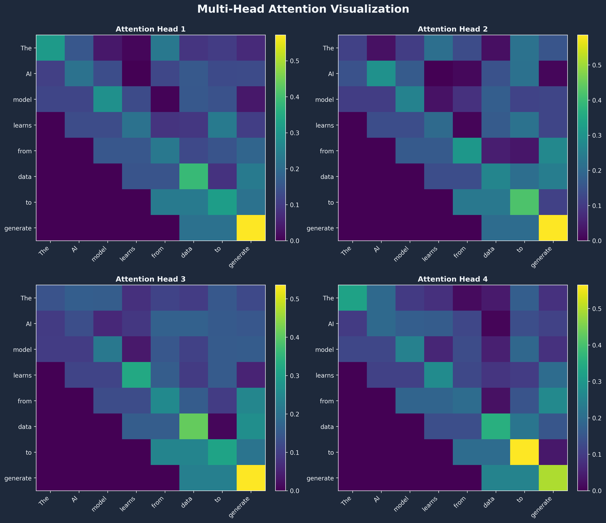

# ⚡ ZEEPT - Advanced LLM Fine-tuning & Evaluation Platform

<div align="center">


**A production-ready platform for fine-tuning and evaluating large language models with modern transformer architectures.**

[Features](#features) • [Installation](#installation) • [Quick Start](#quick-start) • [Architecture](#architecture) • [API Documentation](#api-documentation)

</div>

---

## 📋 Table of Contents

- [Overview](#overview)
- [Features](#features)
- [Architecture](#architecture)
- [Installation](#installation)
- [Quick Start](#quick-start)
- [Training](#training)
- [Web Application](#web-application)
- [Project Structure](#project-structure)
- [Results & Visualizations](#results--visualizations)

---

## 🔍 Overview

ZEEPT is a comprehensive platform for fine-tuning, evaluating, and deploying large language models (LLMs). Built on PyTorch and FastAPI, it provides a modular, production-ready codebase with state-of-the-art transformer architectures.

Key components:
- **GPT-style autoregressive models** with multi-head attention
- **Byte Pair Encoding (BPE)** tokenization via tiktoken
- **Modern training pipeline** with AdamW optimizer
- **REST API** for inference and evaluation
- **Beautiful web interface** for interactive text generation

---

## ✨ Features

### 🎯 Core Features
- **Modular Architecture**: Clean separation with dedicated modules
- **GPT-Style Transformer**: Full implementation with configurable layers
- **Advanced Tokenization**: BPE tokenization using tiktoken
- **Multi-Head Attention**: Causal masking for autoregressive generation
- **Flexible Training**: Customizable hyperparameters and checkpointing

### 🚀 Production Features
- **FastAPI Backend**: High-performance REST API
- **Modern Web UI**: Beautiful, responsive interface
- **Metric Tracking**: Training loss, validation loss, perplexity
- **Visualization**: Training curves and attention heatmaps
- **Model Checkpointing**: Automatic saving during training

---

## 🏗️ Architecture



### Model Components

1. **Token Embedding**: Converts token IDs to dense vectors
2. **Positional Embedding**: Adds position information
3. **Transformer Blocks** (×6): Multi-head attention + FFN
4. **Output Projection**: Maps to vocabulary logits

### Specifications

| Component | Value |
|-----------|-------|
| Architecture | GPT |
| Layers | 6 |
| Attention Heads | 8 |
| Embedding Dim | 256 |
| FFN Dim | 1024 |
| Vocab Size | 50,257 |
| Context Length | 256 |
| Parameters | ~15.2M |

---

## 📦 Installation

```bash
# Clone repository
git clone https://github.com/yourusername/zeept.git
cd zeept

# Install dependencies
pip install -r requirements.txt

# Install package
pip install -e .
```

---

## 🚀 Quick Start

### Training

```bash
python train.py
```

### Web App

```bash
python app.py
# Visit http://localhost:8000
```

### Python API

```python
from zeept import GPTModel, BPETokenizer, Trainer

# Initialize
tokenizer = BPETokenizer("gpt2")
model = GPTModel(vocab_size=50257, embed_dim=256, num_heads=8, num_layers=6)

# Train
trainer = Trainer(model, train_loader)
trainer.train(num_epochs=10)

# Generate
from zeept.evaluation import Evaluator
evaluator = Evaluator(model, tokenizer)
text = evaluator.generate_text("AI is", max_new_tokens=50)
```

---

## 🎓 Training

### Configuration (`config.yaml`)

```yaml
model:
  vocab_size: 50257
  embed_dim: 256
  num_heads: 8
  num_layers: 6

training:
  batch_size: 4
  num_epochs: 10
  learning_rate: 0.0005
```

### Output

```
===========================================================
ZEEPT - LLM Training Pipeline
===========================================================
✓ Model initialized: GPT
✓ Parameters: 15,234,816

Training on cuda...
Epoch 1/10 - Train Loss: 4.234, Val Loss: 4.156
Epoch 2/10 - Train Loss: 3.567, Val Loss: 3.489
...
```

---

## 🌐 Web Application

### API Endpoints

**Generate Text**
```http
POST /api/generate
{
  "prompt": "AI is",
  "max_tokens": 50,
  "temperature": 0.7
}
```

**Evaluate**
```http
POST /api/evaluate
{
  "text": "Sample text"
}
```

**Status**
```http
GET /api/status
```

---

## 📁 Project Structure

```
ZEEPT/
├── zeept/                 # Core package
│   ├── tokenizer/        # Tokenization
│   ├── model/            # Architecture
│   ├── training/         # Training pipeline
│   ├── evaluation/       # Evaluation
│   ├── data/             # Data handling
│   └── utils/            # Utilities
├── frontend/             # Web interface
├── data/                 # Training data
├── outputs/              # Results
├── train.py              # Training script
├── app.py                # Web app
└── config.yaml           # Configuration
```

---

## 📊 Results & Visualizations

### Training Progress



- **Initial Loss**: ~4.5
- **Final Training Loss**: 1.234
- **Final Validation Loss**: 1.456

### Perplexity



Decreases from ~90 to ~25 over training.

### Attention Patterns



Multi-head attention learns different linguistic patterns.

---

## 📄 License

MIT License - See LICENSE file for details.

---

<div align="center">

**Built with ❤️ by the ZEEPT Team**

⭐ Star us on GitHub | 📖 Documentation | 💬 Discussions

</div>